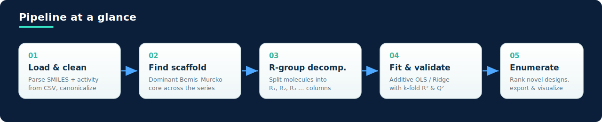

<!-- BADGES -->
<p align="center">
  <a href="https://github.com/a-aghamohammadi/free-wilson-analysis/blob/main/LICENSE">
    </a>
  
  
  
  
  
</p>

---

## Overview

**Free-Wilson analysis** is a classic [quantitative structure–activity relationship (QSAR)](https://en.wikipedia.org/wiki/Quantitative_structure%E2%80%93activity_relationship) method introduced by Spencer Free and James Wilson in 1964. Its central assumption is elegantly simple: the biological activity of a molecule can be approximated as an **additive sum of contributions** from the individual substituents (R-groups) decorating a shared molecular scaffold.

This repository packages that idea into one reproducible notebook. Point it at a CSV of related compounds and their measured activities, and it will find the common core, break each molecule into its R-groups, fit an interpretable linear model, and use the learned per-substituent contributions to **enumerate and rank novel compounds** haven't made.

---

## How it works

<p align="center">
  
</p>

The notebook runs end-to-end as an eight-stage pipeline:

| # | Stage | What happens |
|---|-------|--------------|
| 1 | **Load & clean** | Reads the input CSV, parses SMILES into RDKit molecules, coerces the activity column to numeric, drops unparseable / missing rows, and canonicalizes structures. |
| 2 | **Find the scaffold** | Computes the Bemis–Murcko scaffold of every compound and selects the most frequent one as the shared core. Off-scaffold molecules are reported and excluded. |
| 3 | **R-group decomposition** | Uses the dominant scaffold as a query into RDKit's `RGroupDecomposition`, yielding one column per attachment point (`R1`, `R2`, …) and one row per molecule. |
| 4 | **Inspect diversity** | Summarizes how many unique substituents appear at each R-position, so you can sanity-check the series. |
| 5 | **Fit the model** | Builds a one-hot design matrix (dropping the most common substituent per position as the reference) and fits an additive linear model. |
| 6 | **Coefficient table** | Renders an interactive grid of every R-group with its activity contribution — green for activity-enhancing, red for activity-reducing. |
| 7 | **Enumerate new compounds** | Combines the best substituents at each position, predicts activity for every combination, flags which are novel vs. already in the training set, and ranks them. |
| 8 | **Export & visualize** | Writes the ranked designs to CSV and displays the top predicted structures in an interactive molecule grid. |

### A few modeling details worth knowing

- **Reference encoding.** To avoid perfect multicollinearity, the most common substituent at each position is held out as the baseline. Every coefficient is therefore read *relative to that reference* — positive means more active, negative means less.
- **Honest validation.** The notebook reports both the in-sample **R²** and a k-fold cross-validated **Q²** (with RMSE and MAE for each), so you can gauge real generalization rather than just fit.
- **Graceful fallback.** When the dataset is small or the design matrix is ill-conditioned, it automatically switches from ordinary least squares to a lightly-penalized **Ridge** regression.
- **No re-inventing known compounds.** During enumeration, any candidate that exactly reproduces a training molecule is flagged, so the novel suggestions float to the top of the output.

---

## Getting started

### 1. Prerequisites

You'll need Python 3.9+ and the cheminformatics stack below. RDKit installs most reliably via conda:

```bash
# Recommended: conda for RDKit
conda create -n freewilson python=3.10 -y
conda activate freewilson
conda install -c conda-forge rdkit -y

# The rest via pip
pip install numpy pandas matplotlib scikit-learn mols2grid jupyterlab
```

<details>
<summary><strong>Prefer pure pip?</strong></summary>

```bash
pip install rdkit numpy pandas matplotlib scikit-learn mols2grid jupyterlab
```

Recent RDKit wheels are published on PyPI, so a pip-only install usually works — but conda-forge remains the most robust route across platforms.
</details>

### 2. Clone and launch

```bash
git clone https://github.com/a-aghamohammadi/free-wilson-analysis.git
cd free-wilson-analysis
jupyter lab free_wilson_analysis.ipynb
```

### 3. Point it at your data

Your input CSV needs (at minimum) a column of SMILES strings and a column of activities. Activities should be on a **logarithmic scale** (e.g. `pIC50`, `pKi`) since the model is additive in log-activity:

```csv
SMILES,pIC50
Cc1ccc(cc1)C(=O)Nc1ccccc1,6.82
Clc1ccc(cc1)C(=O)Nc1ccccc1,7.15
...
```

Then edit the configuration cell near the top of the notebook:

```python
CSV_PATH        = "your_compounds.csv"   # path to input CSV
SMILES_COLUMN   = "SMILES"               # name of the SMILES column
ACTIVITY_FIELD  = "pIC50"                # name of the activity column (log-scale!)
OUTPUT_CSV      = "predicted_compounds.csv"

TOP_N_RGROUPS_PER_POSITION = 3           # best substituents to combine per R-position
MAX_NEW_COMPOUNDS          = 500         # cap on rows written to the output CSV
RANDOM_STATE               = 42          # reproducibility
```

---

## Outputs

Running the notebook produces:

- 📊 **Regression metrics** — R², Q², RMSE and MAE (both in-sample and cross-validated), printed inline.
- 📈 **Observed-vs-predicted plot** — training fit and cross-validated points against the ideal diagonal.
- 🧪 **Interactive R-group coefficient grid** — every substituent colored by its contribution to activity.
- 🗂️ **`predicted_compounds.csv`** — novel designs ranked by predicted activity, each with its SMILES, predicted value, novelty flag, and per-position R-group assignment.
- 🔬 **Top-compound molecule grid** — an interactive, sortable view of the most promising predicted structures.

---

## Notes & limitations

- Free-Wilson is **purely additive** — it cannot capture interactions between substituents at different positions, and it can only score R-groups it has *seen* during training.
- Predictions are extrapolations from a linear model: treat the ranked output as a **prioritization aid**, not ground truth. Synthesize and assay the top candidates to confirm.
- The method assumes a genuinely **congeneric series** sharing one dominant scaffold; very diverse datasets will see many compounds excluded at the scaffold step.

---

## Reference

> Free, S. M.; Wilson, J. W. *A Mathematical Contribution to Structure-Activity Studies.*
> **J. Med. Chem.** 1964, *7* (4), 395–399. DOI: [10.1021/jm00334a001](https://doi.org/10.1021/jm00334a001)

---

## License

Released under the [MIT License](LICENSE) © 2026 [InSilicoDev](https://github.com/InSilicoDev).

<p align="center"><sub>Built with RDKit &amp; scikit-learn · contributions and issues welcome</sub></p>
